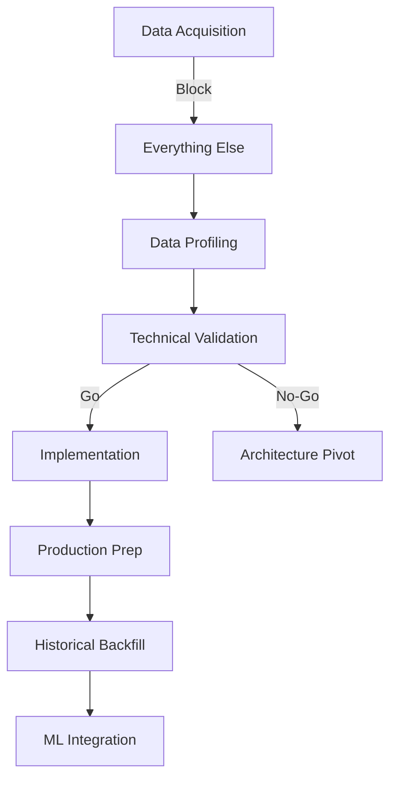

# Implementation Roadmap

## Executive Summary

This roadmap has been critically revised to address the fundamental execution gap where validation work was performed on synthetic data while actual Crypto Lake data remained unacquired. The roadmap now prioritizes **data acquisition as the absolute blocking prerequisite** before any validation or development work can begin.

## Phase 0: Data Acquisition (BLOCKING - Week 1-3)

### Week 1: Access Establishment

**Day 1-2: Crypto Lake Access Verification**
- [ ] Obtain/verify Crypto Lake API credentials
- [ ] Test authentication endpoints
- [ ] Verify data access permissions
- [ ] Check available data inventory
- [ ] **GATE**: Cannot proceed without valid access

**Day 3-4: Data Requirements Definition**
- [ ] Define exact data requirements:
  - Symbol: BTC-USDT
  - Exchange: Binance
  - Date range: 12 months (specify exact dates)
  - Data types: trades, book snapshots, book_delta_v2
- [ ] Estimate data volumes and costs
- [ ] Get budget approval for data acquisition

**Day 5: Acquisition Planning**
- [ ] Create download schedule
- [ ] Plan storage requirements
- [ ] Set up data staging infrastructure
- [ ] Configure monitoring and alerts

### Week 2: Data Download & Validation

**Day 1-3: Initial Download**
- [ ] Download 1-2 weeks sample data
- [ ] Implement integrity validation:
  - Checksum verification
  - Schema validation
  - Temporal continuity checks
- [ ] Document any data quality issues

**Day 4-5: Full Historical Download**
- [ ] Begin 12-month historical download
- [ ] Monitor download progress
- [ ] Handle any failures/retries
- [ ] Validate each downloaded chunk

### Week 3: Data Readiness Certification

**Day 1-2: Comprehensive Validation**
- [ ] Run full data integrity checks
- [ ] Verify complete temporal coverage
- [ ] Validate all required columns present
- [ ] Check data density and volumes

**Day 3-4: Staging Area Organization**
- [ ] Move validated data to ready zone
- [ ] Create data manifest
- [ ] Document data characteristics
- [ ] Set up access controls

**Day 5: Readiness Gate**
- [ ] Issue data readiness certificate
- [ ] Enable Epic 1 work to begin
- [ ] **GATE**: No work proceeds without certification

## Phase 1: Analysis & Profiling (Week 4-5)

### Week 4: Data Profiling & Live Capture

**Day 1-2: Historical Data Profiling**
- [ ] Analyze actual Crypto Lake data structure
- [ ] Profile trades table characteristics
- [ ] Profile book snapshot patterns
- [ ] Assess book_delta_v2 availability
- [ ] Document all findings with real data

**Day 3-5: Live Data Capture Setup**
- [ ] Implement enhanced LiveCapture:
  - Market regime detection
  - Order book initialization protocol
  - Multi-session management
- [ ] Capture different market regimes:
  - High volume period (24-48h)
  - Low volume period (24-48h)
  - Special event period (if available)

### Week 5: Comparative Analysis

**Day 1-3: Statistical Profiling**
- [ ] Implement full fidelity metrics:
  - Trade size distributions
  - Inter-event time analysis
  - Spread dynamics
  - Order book imbalance
  - Volatility clustering
  - Return kurtosis
- [ ] Run Kolmogorov-Smirnov tests
- [ ] Generate comparison visualizations

**Day 4-5: Strategy Selection**
- [ ] Identify gaps between data formats
- [ ] Document reconstruction requirements
- [ ] Select optimal reconstruction strategy
- [ ] Update architecture based on findings

## Phase 2: Technical Validation (Week 6-7)

### Week 6: Performance & Feasibility Testing

**Day 1-2: Delta Feed Validation**
- [ ] Test with ACTUAL book_delta_v2 data
- [ ] Measure real sequence gaps
- [ ] Calculate actual memory requirements
- [ ] Validate update_id continuity

**Day 3-4: Hardware Validation**
- [ ] Process actual 1-hour sample (8M events)
- [ ] Monitor actual memory usage
- [ ] Measure real throughput
- [ ] Test sustained I/O performance

**Day 5: Decimal Strategy Testing**
- [ ] Test decimal128 with actual price data
- [ ] Implement int64 pips fallback
- [ ] Benchmark both with real data

### Week 7: Go/No-Go Decision

**Day 1-2: Performance Baseline**
- [ ] Run end-to-end with actual data
- [ ] Profile all pipeline stages
- [ ] Measure actual latencies
- [ ] Test memory boundaries

**Day 3-4: Decision Compilation**
- [ ] Review all actual data metrics
- [ ] Compare against requirements
- [ ] Document any gaps
- [ ] Prepare recommendation

**Day 5: Go/No-Go Gate**
- [ ] Present findings to stakeholders
- [ ] Make data-driven decision
- [ ] **GATE**: Proceed only with confidence

## Phase 3: Core Implementation (Week 8-11)

### Week 8: Chronological Event Replay

**Priority 1: Stateful Replayer**
- [ ] Implement core algorithm:
  - Data ingestion & labeling
  - Unification & stable sort
  - Schema normalization
  - Stateful replay logic
- [ ] Test with actual data patterns

### Week 9: Order Book Engine

**Priority 1: State Management**
- [ ] Bounded order book (top 20 levels)
- [ ] Trade impact modeling
- [ ] Snapshot validation & resync
- [ ] Drift metric tracking

### Week 10: Streaming Infrastructure

**Priority 1: Memory-Bounded Processing**
- [ ] Implement streaming pipeline
- [ ] Add backpressure handling
- [ ] Create checkpoint system
- [ ] Test with full datasets

### Week 11: Integration & Testing

**Priority 1: End-to-End Validation**
- [ ] Process full historical month
- [ ] Validate against golden samples
- [ ] Run fidelity reports
- [ ] Address any issues

## Phase 4: Production & Fidelity (Week 12-14)

### Week 12: Fidelity Implementation

**Priority 1: Metrics Calculator**
- [ ] Implement full metrics catalogue
- [ ] Create visualization suite
- [ ] Generate automated reports
- [ ] Validate all thresholds

### Week 13: Production Hardening

**Priority 1: Operational Readiness**
- [ ] Create monitoring dashboards
- [ ] Write operational runbooks
- [ ] Implement alerting
- [ ] Plan backfill strategy

### Week 14: Historical Backfill

**Priority 1: Full Dataset Processing**
- [ ] Process 12 months of data
- [ ] Monitor all metrics
- [ ] Generate fidelity reports
- [ ] Certify dataset quality

## Critical Path Dependencies

## Success Criteria by Phase

### Phase 0: Data Acquisition
- ✅ Crypto Lake access verified
- ✅ 12 months data downloaded
- ✅ All integrity checks passed
- ✅ Data readiness certified

### Phase 1: Analysis & Profiling
- ✅ Actual data characteristics documented
- ✅ Multiple market regime samples captured
- ✅ Statistical gaps identified
- ✅ Reconstruction strategy selected

### Phase 2: Technical Validation
- ✅ All tests use actual data
- ✅ Performance validated on real patterns
- ✅ Go/No-Go decision documented
- ✅ Architecture updated if needed

### Phase 3: Core Implementation
- ✅ Chronological Event Replay working
- ✅ Stateful processing validated
- ✅ Memory constraints respected
- ✅ Full pipeline integrated

### Phase 4: Production & Fidelity
- ✅ Fidelity metrics passing (p > 0.05)
- ✅ 12 months processed successfully
- ✅ Operational procedures in place
- ✅ Dataset certified for ML training

## Risk-Adjusted Timeline

### Best Case (Data Available Immediately)
- Week 1-3: Data acquisition
- Week 4-5: Analysis & profiling
- Week 6-7: Technical validation
- Week 8-11: Implementation
- Week 12-14: Production
- **Total: 14 weeks**

### Likely Case (Data Acquisition Delays)
- Week 1-4: Data acquisition (delays)
- Week 5-6: Analysis & profiling
- Week 7-8: Technical validation
- Week 9-13: Implementation
- Week 14-16: Production
- **Total: 16 weeks**

### Worst Case (Major Data Issues)
- Week 1-6: Data acquisition (major issues)
- Week 7-8: Analysis & profiling
- Week 9-10: Technical validation
- Week 11-16: Implementation
- Week 17-20: Production
- **Total: 20 weeks**

## Immediate Actions Required

1. **TODAY - Critical**
   - Verify Crypto Lake subscription status
   - Check available budget for data costs
   - Confirm who has API access

2. **This Week - Urgent**
   - Establish data access
   - Begin sample download
   - Set up staging infrastructure

3. **Next Week - Important**
   - Complete initial validation
   - Start full download
   - Plan analysis phase

## Communication Plan

### Daily During Phase 0
- Data acquisition progress
- Any blocking issues
- Cost updates

### Weekly Updates
- Phase progress report
- Risk assessment
- Timeline adjustments

### Phase Gates
- End of Phase 0: Data readiness review
- End of Phase 1: Analysis findings
- End of Phase 2: Go/No-Go decision
- End of Phase 3: Implementation demo
- End of Phase 4: Production certification

## Critical Success Factors

1. **No Synthetic Data**: All validation uses actual Crypto Lake data
2. **Data First**: No development without confirmed data access
3. **Reality Check**: All assumptions validated with real data
4. **Fidelity Focus**: Every decision optimizes for statistical fidelity
5. **Continuous Validation**: Quality checks at every stage

---

**Remember**: Without actual data, all other work is meaningless. The multi-week data acquisition phase protects against months of wasted effort on invalid assumptions. Stay focused on getting real data first.