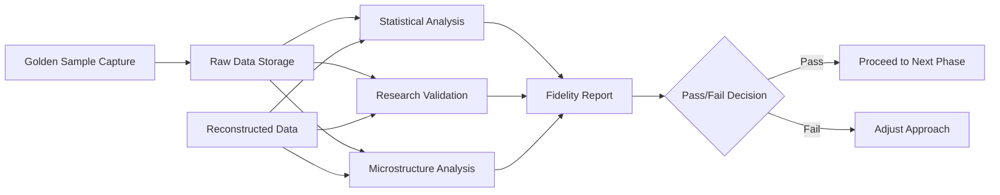

# Validation Architecture

## Overview

The ValidationFramework is a new critical component that ensures all architectural decisions and implementation choices are based on empirical evidence rather than assumptions. This component acts as the quality gate for the entire pipeline.

## Architectural Principles

1. **Empirical Evidence Over Theory**: Every assumption must be tested
2. **Fail Fast**: Catch issues early through continuous validation
3. **Automated Verification**: All tests must be reproducible and automated
4. **Ground Truth Comparison**: Golden samples serve as the source of truth

## Component Design

### Core Components

```
ValidationFramework/
├── GoldenSampleManager/
│   ├── CaptureOrchestrator      # Manages capture sessions
│   ├── MarketRegimeDetector     # Identifies market conditions
│   └── StorageManager           # Handles raw data persistence
├── StatisticalValidators/
│   ├── DistributionAnalyzer     # K-S, Anderson-Darling tests
│   ├── MicrostructureValidator  # Spread, depth, tick analysis
│   └── ExecutionQualityChecker  # Fill rates, slippage
├── ResearchClaimValidator/
│   ├── LatencyMeasurer          # Tests timing assumptions
│   ├── DataCompletenessChecker  # Validates data quality claims
│   └── PerformanceBenchmarker   # Tests throughput claims
└── ReportGenerator/
    ├── FidelityScorer           # Overall quality metrics
    ├── ComparisonVisualizer     # Visual diff tools
    └── DecisionRecommender      # Go/no-go suggestions
```

## Detailed Component Specifications

### 1. GoldenSampleManager

**Purpose**: Capture and manage raw, unmodified market data from live sources

**Key Responsibilities**:
- WebSocket connection management with exact Binance protocol
- Raw message preservation without any transformation
- Market regime detection and tagging
- Secure storage with encryption at rest

**Interface**:
```python
class GoldenSampleManager:
    async def capture_session(
        self,
        symbol: str,
        duration_hours: int,
        market_regime: MarketRegime,
        output_path: Path
    ) -> CaptureMetrics:
        """Capture raw WebSocket data for specified duration."""
        
    def list_captures(self) -> list[CaptureMetadata]:
        """List all available golden samples."""
        
    def load_capture(self, capture_id: str) -> GoldenSample:
        """Load a specific capture for validation."""
```

**Critical Implementation Details**:
- MUST use combined stream: `/stream?streams=symbol@trade/symbol@depth@100ms`
- MUST preserve exact message format: `{"capture_ns": ns, "stream": name, "data": raw}`
- MUST implement order book synchronization protocol correctly
- MUST handle reconnection without data loss

### 2. StatisticalValidators

**Purpose**: Implement academic-grade statistical tests for distribution comparison

**Key Tests**:
```python
class DistributionAnalyzer:
    def kolmogorov_smirnov_test(
        self,
        sample1: np.array,
        sample2: np.array,
        alpha: float = 0.05
    ) -> KSTestResult:
        """Two-sample K-S test for distribution equality."""
        
    def anderson_darling_test(
        self,
        data: np.array,
        distribution: str = 'norm'
    ) -> ADTestResult:
        """Test if data follows specified distribution."""
        
    def power_law_validation(
        self,
        trade_sizes: np.array,
        expected_exponent: float = 2.4,
        tolerance: float = 0.1
    ) -> PowerLawResult:
        """Validate power law distribution of trade sizes."""
```

**Microstructure Validation**:
```python
class MicrostructureValidator:
    def validate_spread_dynamics(
        self,
        golden: GoldenSample,
        reconstructed: ReconstructedData
    ) -> SpreadMetrics:
        """Compare spread behavior and mean reversion."""
        
    def check_sequence_gaps(
        self,
        order_book_updates: list[OrderBookUpdate]
    ) -> GapAnalysis:
        """Detect missing sequences in order book updates."""
        
    def correlate_book_depth(
        self,
        golden_books: list[OrderBook],
        reconstructed_books: list[OrderBook],
        levels: int = 20
    ) -> DepthCorrelation:
        """Correlate order book depth at each price level."""
```

### 3. ResearchClaimValidator

**Purpose**: Systematically test each claim from AI research documents

**Test Categories**:

```python
class ResearchClaimValidator:
    def validate_origin_time_latency(self) -> LatencyReport:
        """Test claim: origin_time latency is 10-50ms"""
        # Measure actual latency distribution
        # Compare with research claims
        # Document findings
        
    def validate_snapshot_frequency(self) -> FrequencyReport:
        """Test claim: snapshots arrive every 100ms"""
        # Measure actual snapshot intervals
        # Check consistency across market conditions
        # Verify 20-level depth claim
        
    def validate_websocket_ordering(self) -> OrderingReport:
        """Test claim: combined streams prevent out-of-order"""
        # Compare separate vs combined stream ordering
        # Quantify out-of-order frequency
        # Measure timing differences
        
    def validate_reconstruction_fidelity(self) -> FidelityReport:
        """Test both reconstruction approaches"""
        # Implement snapshot-based reconstruction
        # Implement full event reconstruction
        # Compare fidelity metrics
        # Document performance differences
```

### 4. ReportGenerator

**Purpose**: Generate comprehensive validation reports with actionable recommendations

**Report Structure**:
```python
@dataclass
class ValidationReport:
    # Summary
    overall_score: float  # 0-100
    pass_fail: bool
    confidence_level: float
    
    # Detailed Results
    statistical_tests: StatisticalResults
    microstructure_analysis: MicrostructureResults
    execution_quality: ExecutionResults
    research_validations: ResearchResults
    
    # Visualizations
    distribution_plots: list[Figure]
    correlation_matrices: list[Figure]
    time_series_comparisons: list[Figure]
    
    # Recommendations
    reconstruction_approach: str
    configuration_params: dict
    risk_factors: list[Risk]
    next_steps: list[str]
```

## Integration Points

### With LiveCapture (Story 1.2)
- LiveCapture produces golden samples
- ValidationFramework consumes and validates them
- Feedback loop for capture quality

### With Reconstructor
- Reconstructor output validated against golden samples
- Continuous validation during development
- Performance benchmarks tracked

### With DataAssessor
- Share statistical analysis tools
- Common data quality metrics
- Unified reporting format

## Validation Pipeline



## Quality Gates

### Gate 1: Golden Sample Quality
- Minimum 24-hour capture required
- No gaps or disconnections allowed
- Market regime properly tagged

### Gate 2: Statistical Significance
- All K-S tests must show p-value > 0.05
- Power law exponent within 2.4±0.1
- Correlation > 0.99 for critical metrics

### Gate 3: Research Validation
- Key assumptions must be verified
- Conflicting claims must be resolved
- Performance within expected bounds

### Gate 4: Production Readiness
- Memory usage within limits
- Throughput meets requirements
- Error recovery tested

## Implementation Priority

### Phase 1: Core Framework (Week 1)
1. GoldenSampleManager with correct WebSocket implementation
2. Basic statistical validators (K-S test, correlation)
3. Simple report generation

### Phase 2: Extended Validation (Week 2)
1. Full statistical test suite
2. Research claim validators
3. Automated comparison pipeline

### Phase 3: Production Features (Week 3)
1. Continuous validation monitoring
2. Performance optimization
3. Advanced visualizations

## Success Metrics

The ValidationFramework succeeds when:
1. ✅ Can capture 24+ hours of golden samples without gaps
2. ✅ Statistical tests are automated and reproducible
3. ✅ Research claims are empirically verified/refuted
4. ✅ Reports provide clear go/no-go decisions
5. ✅ Validation runs continuously without manual intervention

## Risk Mitigation

### Technical Risks
- **WebSocket Disconnections**: Implement robust reconnection with buffering
- **Storage Requirements**: Compress golden samples, implement rotation
- **Computation Time**: Parallelize statistical tests, use sampling

### Process Risks
- **Validation Bottleneck**: Automate as much as possible
- **False Positives**: Use multiple metrics, not single tests
- **Drift Over Time**: Schedule regular re-validation

## Future Extensions

1. **Machine Learning Validators**: Detect subtle pattern differences
2. **Anomaly Detection**: Flag unusual market conditions
3. **Cross-Exchange Validation**: Compare multiple data sources
4. **Real-Time Monitoring**: Live validation during production