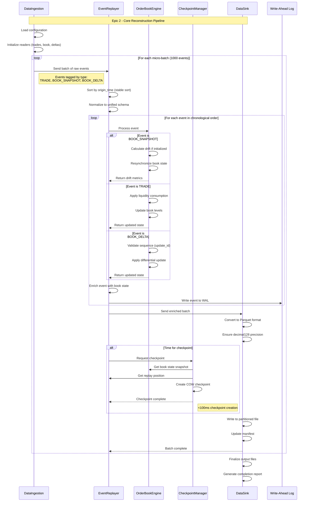
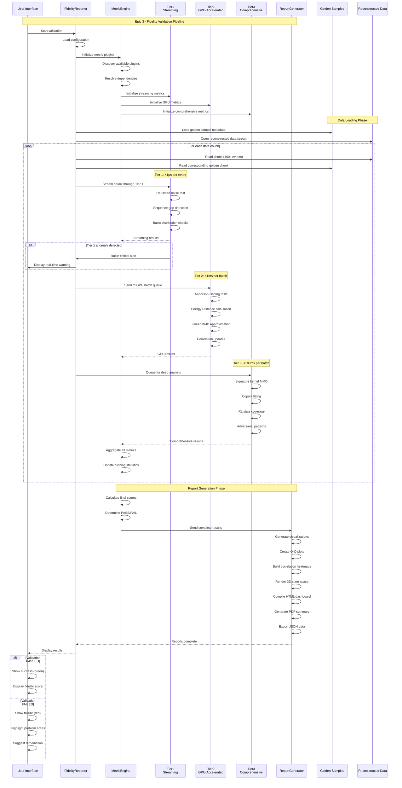
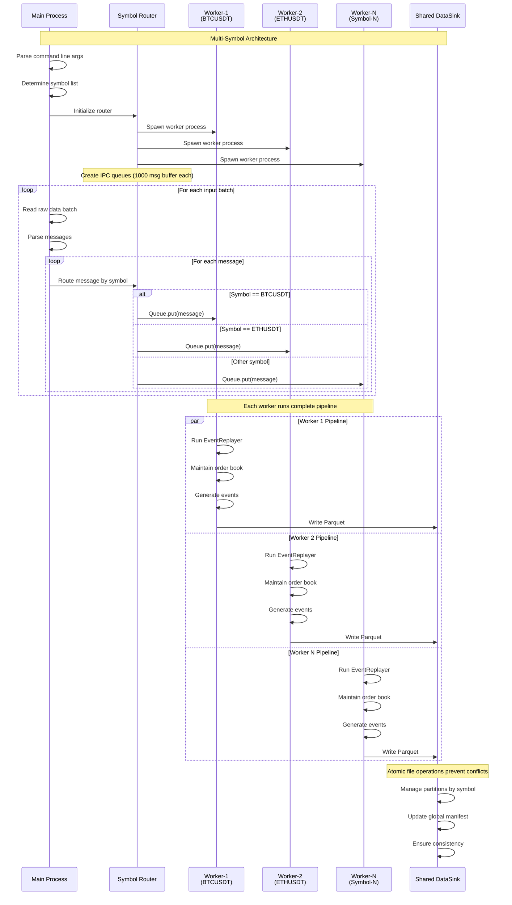
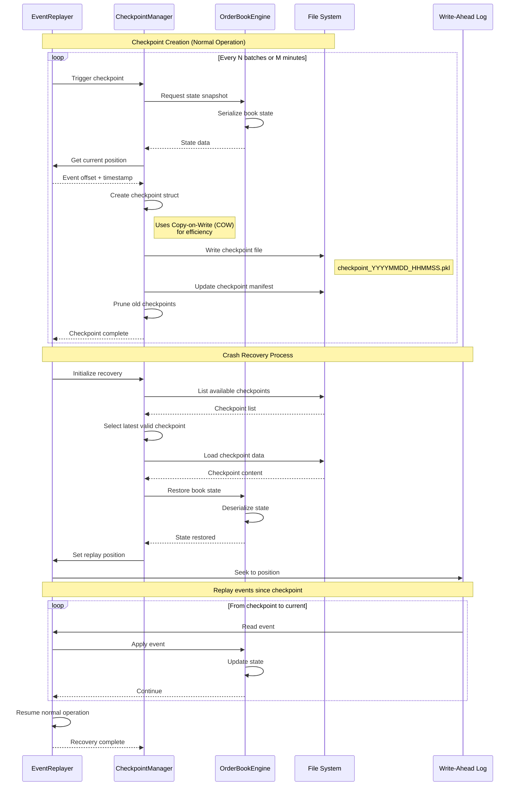
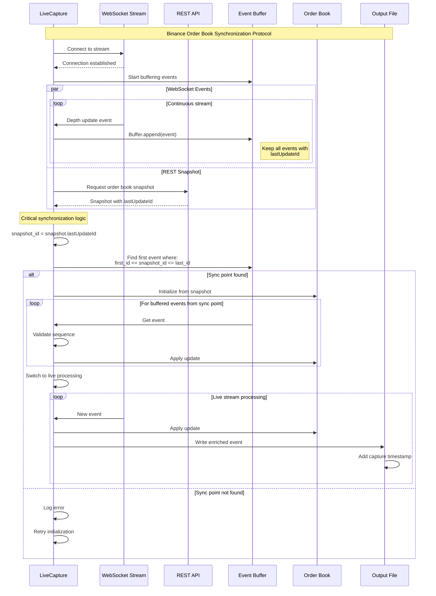

# Core Workflows

**Created**: 2025-07-30  
**Status**: Initial Design  
**Purpose**: Visual documentation of key data flows through the pipeline

## Overview

This document provides detailed sequence diagrams for the core workflows in the RLX Data Pipeline. These diagrams illustrate the interaction between components and the flow of data through each major process.

## Workflow 1: End-to-End Data Reconstruction

This workflow shows how raw Crypto Lake data is transformed into a unified event stream through the reconstruction pipeline.

### Key Points:
- **Micro-batching**: Processes 1000 events at a time for optimal performance
- **Stable Sort**: Preserves order for events with same timestamp
- **State Management**: Order book maintains full L2 state throughout
- **Checkpointing**: Non-blocking COW snapshots every N batches
- **Precision**: Decimal128(38,18) maintained end-to-end

## Workflow 2: Fidelity Validation Process

This workflow illustrates how the FidelityReporter validates reconstructed data against golden samples using the three-tier validation architecture.

### Key Points:
- **Three-Tier Architecture**: Optimizes for both speed and thoroughness
- **Parallel Processing**: All tiers can run concurrently on different batches
- **Real-Time Alerts**: Tier 1 provides immediate feedback on critical issues
- **GPU Acceleration**: Tier 2 achieves 100x speedup for complex statistics
- **Comprehensive Analysis**: Tier 3 performs deep validation including RL metrics

## Workflow 3: Multi-Symbol Processing

This workflow shows how the pipeline handles multiple trading symbols concurrently.

### Key Points:
- **Process Isolation**: Each symbol runs in separate process (avoids GIL)
- **Linear Scaling**: Performance scales with number of CPU cores
- **Backpressure**: Queue size limits prevent memory overflow
- **Atomic Writes**: Shared DataSink handles concurrent access safely

## Workflow 4: Checkpoint and Recovery

This workflow demonstrates the checkpoint creation and recovery process.

### Key Points:
- **Non-Blocking**: COW ensures checkpointing doesn't pause processing
- **Fast Recovery**: Only replay events since last checkpoint
- **Consistency**: WAL ensures no events are lost
- **Automatic Pruning**: Old checkpoints removed to save space

## Workflow 5: Live Capture Synchronization

This workflow shows the critical order book initialization process for live data capture.

### Key Points:
- **Guaranteed Consistency**: Follows Binance official synchronization protocol
- **No Gap Tolerance**: Must find exact sync point for integrity
- **Timestamp Precision**: Captures both exchange and local timestamps
- **Buffering Strategy**: Ensures no updates lost during initialization

## Performance Characteristics

### Throughput Metrics
- **Reconstruction**: 336-345K messages/second
- **Validation Tier 1**: 336K+ messages/second (no slowdown)
- **Validation Tier 2**: 50K messages/second (GPU batched)
- **Validation Tier 3**: 10K messages/second (comprehensive)

### Memory Usage
- **Per Symbol Pipeline**: <1GB
- **Checkpoint Size**: ~200MB per symbol
- **WAL Buffer**: 100MB rotating
- **GPU Batch Size**: Optimized for GPU memory

### Latency Targets
- **End-to-End Reconstruction**: <10s per million events
- **Checkpoint Creation**: <100ms
- **Recovery Time**: <30s from checkpoint
- **Validation Report**: <5 minutes for 24 hours of data

## Error Handling Patterns

All workflows implement consistent error handling:

1. **Retry Logic**: Transient failures retry with exponential backoff
2. **Circuit Breakers**: Prevent cascade failures
3. **Graceful Degradation**: Continue processing other symbols on failure
4. **Comprehensive Logging**: Full audit trail for debugging
5. **Alert Integration**: Critical errors trigger immediate notifications

## Conclusion

These core workflows represent the essential data flows through the RLX Data Pipeline. Each workflow is designed for high performance, reliability, and maintainability, with clear error handling and recovery mechanisms. The visual representations help ensure consistent implementation across the development team.