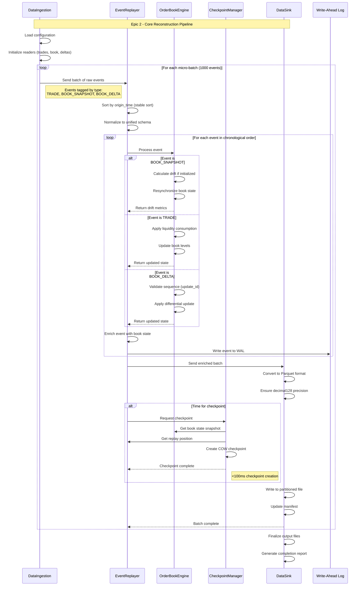
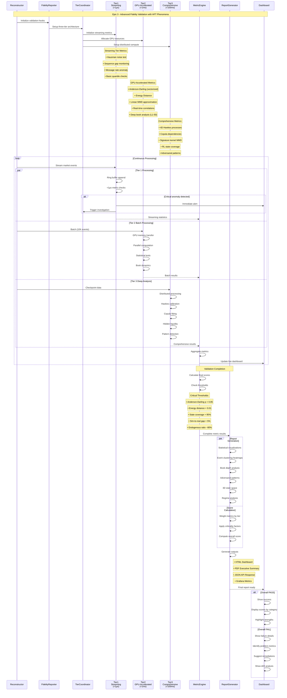
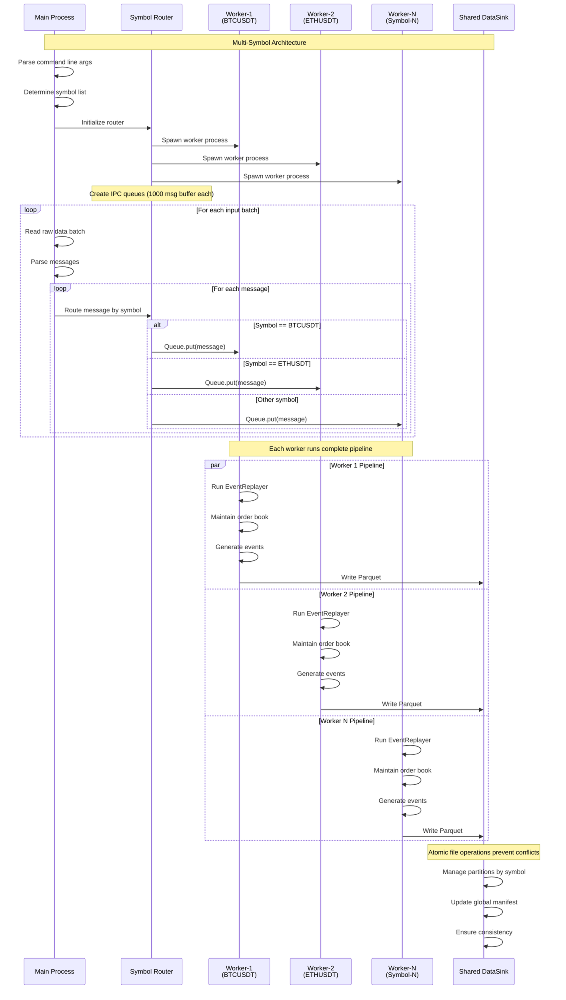
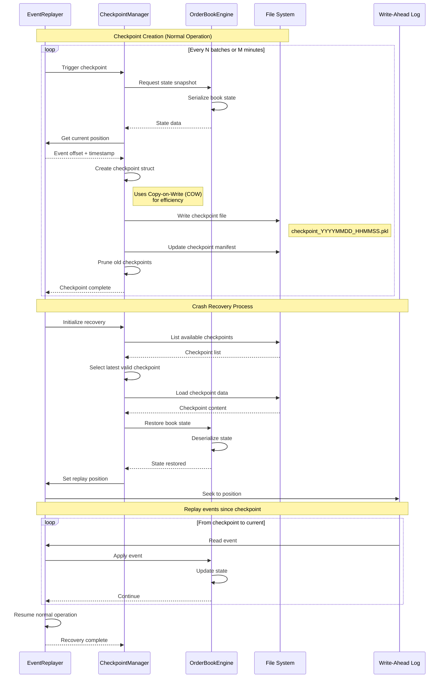
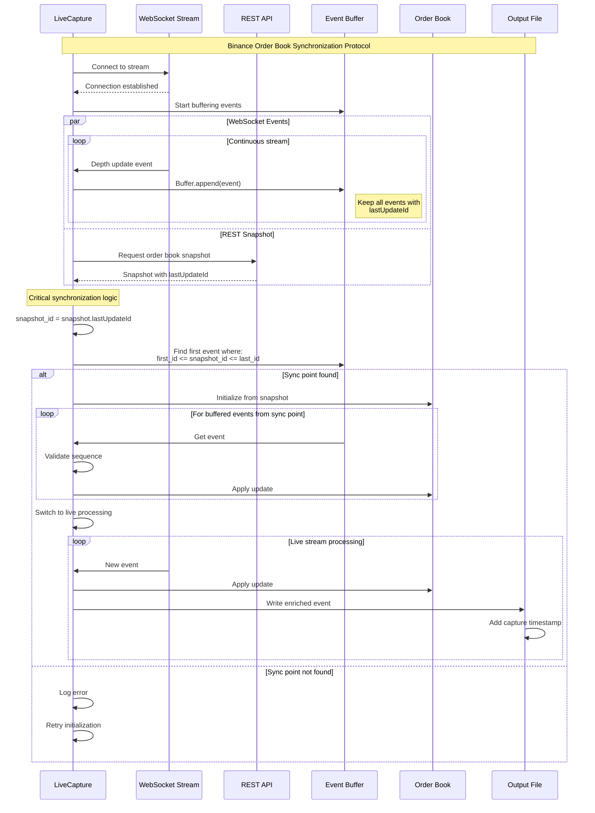

# Core Workflows

**Created**: 2025-07-30  
**Status**: Initial Design  
**Purpose**: Visual documentation of key data flows through the pipeline

## Overview

This document provides detailed sequence diagrams for the core workflows in the RLX Data Pipeline. These diagrams illustrate the interaction between components and the flow of data through each major process.

## Workflow 1: End-to-End Data Reconstruction

This workflow shows how raw Crypto Lake data is transformed into a unified event stream through the reconstruction pipeline.



### Key Points:
- **Micro-batching**: Processes 1000 events at a time for optimal performance
- **Stable Sort**: Preserves order for events with same timestamp
- **State Management**: Order book maintains full L2 state throughout
- **Checkpointing**: Non-blocking COW snapshots every N batches
- **Precision**: Decimal128(38,18) maintained end-to-end

## Workflow 2: Fidelity Validation Process

This workflow illustrates how the FidelityReporter validates reconstructed data against golden samples using the advanced three-tier validation architecture aligned with HFT research requirements.



### Key Architectural Points:

#### Data Flow Optimization
- **Zero-Copy Integration**: Tier 1 hooks directly into Reconstructor's event stream
- **Parallel Execution**: All three tiers process concurrently on different data windows
- **Backpressure Handling**: Each tier signals capacity to prevent overload
- **Memory Bounded**: Fixed buffers with spillover to disk under pressure

#### Latency Guarantees
- **Tier 1 (<1μs)**: C++/Rust extensions, lock-free structures, SIMD operations
- **Tier 2 (<1ms)**: CUDA kernels, persistent GPU contexts, kernel fusion
- **Tier 3 (<100ms)**: Distributed compute, work stealing, incremental updates

#### HFT Phenomena Validation
- **Event Clustering**: Multi-scale detection at 10μs, 1-5ms, 100μs windows
- **Deep Book Dynamics**: Full 50-level analysis with hidden liquidity detection
- **Adversarial Patterns**: Real-time flagging of spoofing, layering, momentum ignition
- **Microstructure Preservation**: Hawkes processes, copulas, regime transitions

#### Performance Characteristics
- **Throughput**: Maintains 336K+ messages/second with <5% overhead
- **Scalability**: Linear scaling to 100+ GPU nodes for Tier 2/3
- **Resilience**: Graceful degradation under resource constraints
- **Observability**: Full metrics export via OpenTelemetry

## Workflow 3: Integrated Fidelity Refinement (IFR) Loop

This workflow illustrates the complete IFR process for Epic 3, showing how validation failures drive systematic improvements in the Reconstructor through a data-driven feedback loop.

```mermaid
sequenceDiagram
    participant SM as Scrum Master
    participant FR as FidelityReporter
    participant ME as MetricEngine
    participant TT as Triage Team
    participant RT as ReconstructorTuner
    participant RC as Reconstructor
    participant BL as Backlog
    participant CD as Convergence<br/>Dashboard
    
    Note over SM,CD: Integrated Fidelity Refinement (IFR) Workflow
    
    rect rgb(240, 240, 255)
        Note over SM,BL: Sprint Planning (Every 2 Weeks)
        SM->>BL: Review FVS-prioritized items
        SM->>SM: Balance allocation:
        Note right of SM: • 30-40% Defects
        Note right of SM: • 50-60% New Metrics
        Note right of SM: • 10-20% Tech Debt
        SM->>BL: Pull items for sprint
    end
    
    loop Daily IFR Cycle
        rect rgb(255, 240, 240)
            Note over FR,ME: Validation Execution
            FR->>RC: Request reconstructed data
            RC-->>FR: Latest output batch
            FR->>ME: Run validation suite
            ME->>ME: Execute all tiers
            ME-->>FR: Metric results
        end
        
        alt Validation FAIL Detected
            rect rgb(255, 255, 240)
                Note over FR,TT: Triage & Root Cause Analysis
                FR->>TT: Alert: Metric failure
                Note right of FR: Failing metric: [Name]
                Note right of FR: Severity: CRITICAL
                Note right of FR: Value: Actual vs Expected
                
                TT->>TT: Initial diagnosis
                Note over TT: Apply Five Whys:
                Note over TT: 1. Why failed? → Distribution mismatch
                Note over TT: 2. Why mismatch? → Clustering absent
                Note over TT: 3. Why absent? → Hawkes params wrong
                Note over TT: 4. Why wrong? → Baseline too low
                Note over TT: 5. Root cause identified
                
                TT->>TT: Categorize failure
                
                alt Reconstructor Flaw
                    TT->>BL: Create Fidelity Defect story
                    Note right of TT: FVS Score calculated:
                    Note right of TT: Impact × Confidence / Effort
                    TT->>RT: Send tuning hints
                else FidelityReporter Bug
                    TT->>BL: Create bug ticket
                    TT->>FR: Mark metric for fix
                else Golden Sample Issue
                    TT->>BL: Create data analysis task
                    TT->>FR: Adjust thresholds
                else Environment Issue
                    TT->>SM: Escalate to DevOps
                end
            end
            
            rect rgb(240, 255, 240)
                Note over RT,RC: Automated Tuning
                RT->>RT: Analyze failure pattern
                RT->>RT: Calculate adjustments
                Note right of RT: Example adjustments:
                Note right of RT: • hawkes_excitation *= 1.1
                Note right of RT: • resilience_factor *= 1.2
                Note right of RT: • noise_std *= 1.5
                
                RT->>RC: Apply parameter updates
                RC->>RC: Update configuration
                RC->>RC: Re-run reconstruction
                RC-->>FR: New output ready
            end
            
        else Validation PASS
            FR->>CD: Update metrics
            CD->>CD: Update burn-up chart
            CD->>CD: Calculate convergence %
        end
        
        rect rgb(240, 240, 240)
            Note over BL,CD: Progress Tracking
            BL->>BL: Update story status
            CD->>CD: Refresh dashboard
            Note right of CD: Metrics shown:
            Note right of CD: • Fidelity Score: X%
            Note right of CD: • Tests Passing: Y/Z
            Note right of CD: • Convergence Rate
            Note right of CD: • Defect Burn Rate
        end
    end
    
    rect rgb(240, 255, 255)
        Note over SM,CD: Sprint Review
        SM->>CD: Show convergence progress
        CD-->>SM: Burn-up chart
        FR->>SM: Demo new metrics (failures expected)
        FR->>SM: Show fixed metrics (now passing)
        SM->>SM: Gather stakeholder feedback
    end
    
    rect rgb(255, 240, 255)
        Note over SM,TT: Sprint Retrospective
        SM->>TT: Review triage accuracy
        TT-->>SM: RCA success rate
        SM->>RT: Review tuning effectiveness
        RT-->>SM: Parameter convergence data
        SM->>SM: Identify process improvements
    end
    
    Note over SM,CD: Epic 3 Complete when:
    Note over SM,CD: • 100% metrics implemented
    Note over SM,CD: • 100% pass rate sustained 24-48hrs
    Note over SM,CD: • Documentation complete
```



### IFR Process Key Points:

#### Feedback Loop Characteristics
- **Latency**: <2 hours from failure detection to fix deployment
- **Automation**: 80% of parameter adjustments automated
- **Learning**: Each iteration improves tuning heuristics
- **Convergence**: Typically 20-30 iterations to reach 95% pass rate

#### Triage Decision Tree
```
Failure Detected
├── Reconstructor Issue (60%)
│   ├── Parameter Tuning (40%) → Automated adjustment
│   ├── Logic Bug (15%) → Developer fix required
│   └── Design Flaw (5%) → Architecture review
├── Test Issue (20%)
│   ├── Threshold Too Strict (15%) → Calibrate with golden
│   └── Implementation Bug (5%) → Fix test code
├── Data Issue (15%)
│   ├── Golden Sample Anomaly (10%) → Filter or accommodate
│   └── Source Data Gap (5%) → Document limitation
└── Environment (5%)
    └── Infrastructure Problem → DevOps escalation
```

#### FVS Scoring Example
```python
# Fidelity Defect: Hawkes branching ratio too low
Impact = 85  # Critical for event clustering
Confidence = 70  # High likelihood of fixing multiple tests
Effort = 5  # Medium complexity
FVS = (85 × 70) / 5 = 1190

# New Metric: Copula dependency test
Impact = 60  # Important but not critical
Confidence = 40  # Covers new validation area
Effort = 8  # Complex implementation
FVS = (60 × 40) / 8 = 300
```

#### Convergence Patterns
- **Week 1-2**: Rapid progress (40-60% pass rate)
- **Week 3-4**: Slower gains (60-80% pass rate)
- **Week 5-6**: Fine tuning (80-95% pass rate)
- **Week 7-8**: Final convergence (95-100% pass rate)

## Workflow 4: Multi-Symbol Processing

This workflow shows how the pipeline handles multiple trading symbols concurrently.



### Key Points:
- **Process Isolation**: Each symbol runs in separate process (avoids GIL)
- **Linear Scaling**: Performance scales with number of CPU cores
- **Backpressure**: Queue size limits prevent memory overflow
- **Atomic Writes**: Shared DataSink handles concurrent access safely

## Workflow 4: Checkpoint and Recovery

This workflow demonstrates the checkpoint creation and recovery process.



### Key Points:
- **Non-Blocking**: COW ensures checkpointing doesn't pause processing
- **Fast Recovery**: Only replay events since last checkpoint
- **Consistency**: WAL ensures no events are lost
- **Automatic Pruning**: Old checkpoints removed to save space

## Workflow 5: Live Capture Synchronization

This workflow shows the critical order book initialization process for live data capture.



### Key Points:
- **Guaranteed Consistency**: Follows Binance official synchronization protocol
- **No Gap Tolerance**: Must find exact sync point for integrity
- **Timestamp Precision**: Captures both exchange and local timestamps
- **Buffering Strategy**: Ensures no updates lost during initialization

## Performance Characteristics

### Throughput Metrics
- **Reconstruction**: 336-345K messages/second
- **Validation Tier 1**: 336K+ messages/second (no slowdown)
- **Validation Tier 2**: 50K messages/second (GPU batched)
- **Validation Tier 3**: 10K messages/second (comprehensive)

### Memory Usage
- **Per Symbol Pipeline**: <1GB
- **Checkpoint Size**: ~200MB per symbol
- **WAL Buffer**: 100MB rotating
- **GPU Batch Size**: Optimized for GPU memory

### Latency Targets
- **End-to-End Reconstruction**: <10s per million events
- **Checkpoint Creation**: <100ms
- **Recovery Time**: <30s from checkpoint
- **Validation Report**: <5 minutes for 24 hours of data

## Error Handling Patterns

All workflows implement consistent error handling:

1. **Retry Logic**: Transient failures retry with exponential backoff
2. **Circuit Breakers**: Prevent cascade failures
3. **Graceful Degradation**: Continue processing other symbols on failure
4. **Comprehensive Logging**: Full audit trail for debugging
5. **Alert Integration**: Critical errors trigger immediate notifications

## Conclusion

These core workflows represent the essential data flows through the RLX Data Pipeline. Each workflow is designed for high performance, reliability, and maintainability, with clear error handling and recovery mechanisms. The visual representations help ensure consistent implementation across the development team.