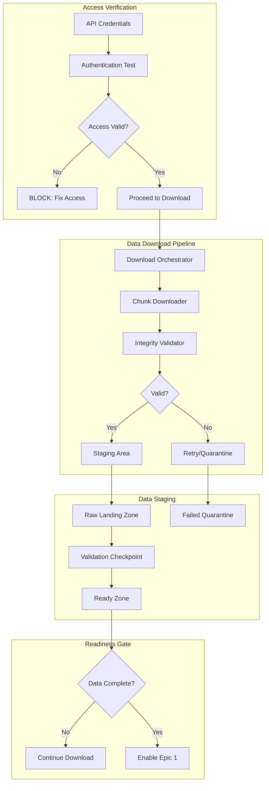
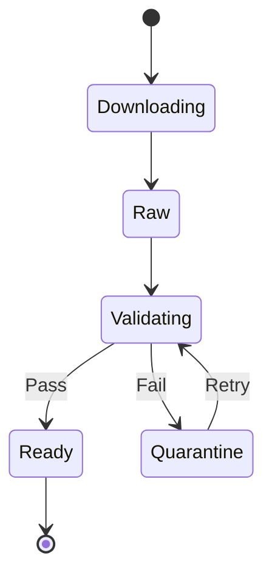

# Data Acquisition Architecture

## Overview

This document defines the architecture for **Epic 0: Data Acquisition**, which is the **blocking prerequisite** for all subsequent work in the RLX Co-Pilot Data Pipeline project. No validation, analysis, or pipeline development can proceed without first establishing access to and acquiring actual historical data from Crypto Lake.

## Critical Requirements

### Blocking Prerequisites
- **No synthetic data**: All validation must use actual Crypto Lake historical data
- **Verified access**: API credentials must be validated before any development
- **Data integrity**: All downloaded data must pass integrity checks before use
- **Audit trail**: Complete logging of all data acquisition activities

## High-Level Data Acquisition Flow



## Component Architecture

### 1. DataAcquisitionManager

**Purpose**: Orchestrates the entire data acquisition process from authentication to final validation.

**Key Responsibilities**:
- Manage Crypto Lake API authentication
- Coordinate download activities
- Monitor progress and handle failures
- Enforce blocking gates

**Implementation Details**:
```python
class DataAcquisitionManager:
    def __init__(self, config: AcquisitionConfig):
        self.api_client = CryptoLakeAPIClient(config.credentials)
        self.downloader = DataDownloader(config.download_settings)
        self.validator = IntegrityValidator(config.validation_rules)
        self.staging = DataStagingArea(config.staging_path)
        
    async def acquire_data(self, requirements: DataRequirements) -> AcquisitionResult:
        # Step 1: Verify access
        if not await self.verify_access():
            raise BlockingError("Cannot proceed without valid Crypto Lake access")
            
        # Step 2: Download data
        manifest = await self.download_data(requirements)
        
        # Step 3: Validate integrity
        validation_report = await self.validate_data(manifest)
        
        # Step 4: Stage validated data
        if validation_report.all_passed:
            await self.staging.promote_to_ready(manifest)
            return AcquisitionResult(success=True, manifest=manifest)
        else:
            await self.staging.quarantine_failed(manifest, validation_report)
            raise DataIntegrityError(validation_report)
```

### 2. CryptoLakeAPIClient

**Purpose**: Handles all interactions with Crypto Lake API, including authentication and data retrieval.

**Key Features**:
- Credential management (no hardcoding)
- Rate limiting compliance
- Retry logic with exponential backoff
- Session management

**Security Considerations**:
- API keys stored in environment variables or secure vault
- All requests use HTTPS
- Credentials never logged
- Session tokens refreshed automatically

### 3. DataDownloader

**Purpose**: Manages the actual download of historical data with resilience and monitoring.

**Key Features**:
- Chunked downloads for large files
- Resume capability for interrupted downloads
- Parallel downloads with concurrency limits
- Progress tracking and reporting

**Download Strategy**:
```python
class DataDownloader:
    async def download_dataset(self, dataset_spec: DatasetSpec) -> DownloadManifest:
        chunks = self.partition_into_chunks(dataset_spec)
        
        async with asyncio.TaskGroup() as tg:
            for chunk in chunks:
                tg.create_task(self.download_chunk(chunk))
                
        return self.create_manifest(chunks)
        
    async def download_chunk(self, chunk: DataChunk):
        # Implement retry logic
        for attempt in range(self.max_retries):
            try:
                await self.download_with_resume(chunk)
                await self.verify_checksum(chunk)
                break
            except DownloadError as e:
                if attempt == self.max_retries - 1:
                    raise
                await asyncio.sleep(2 ** attempt)
```

### 4. IntegrityValidator

**Purpose**: Ensures all downloaded data meets quality and completeness requirements.

**Validation Checks**:
1. **File Integrity**:
   - Checksum verification (SHA-256)
   - File size validation
   - Format verification (valid Parquet)

2. **Schema Validation**:
   - Expected columns present
   - Data types match specification
   - No critical columns with all nulls

3. **Temporal Validation**:
   - Continuous date coverage
   - No missing time periods
   - Timestamp monotonicity

4. **Volume Validation**:
   - Expected row counts
   - Reasonable data density
   - No suspicious gaps

**Implementation**:
```python
class IntegrityValidator:
    async def validate_file(self, file_path: Path) -> ValidationResult:
        results = []
        
        # Level 1: File checks
        results.append(await self.check_file_integrity(file_path))
        
        # Level 2: Schema checks
        results.append(await self.check_schema(file_path))
        
        # Level 3: Data quality checks
        results.append(await self.check_data_quality(file_path))
        
        # Level 4: Temporal continuity
        results.append(await self.check_temporal_continuity(file_path))
        
        return ValidationResult(
            passed=all(r.passed for r in results),
            details=results
        )
```

### 5. DataStagingArea

**Purpose**: Manages the lifecycle of downloaded data through validation stages.

**Staging Zones**:

```
data/
├── staging/
│   ├── raw/           # Initial downloads
│   ├── validating/    # Under validation
│   ├── ready/         # Passed all checks
│   └── quarantine/    # Failed validation
└── logs/
    ├── download/      # Download logs
    ├── validation/    # Validation reports
    └── manifest/      # Data manifests
```

**State Transitions**:


## Data Acquisition Workflow

### Phase 1: Access Verification
1. Load credentials from secure storage
2. Test API authentication
3. Verify data access permissions
4. Check available datasets
5. **GATE**: Block if access invalid

### Phase 2: Requirements Definition
```yaml
DataRequirements:
  symbol: BTC-USDT
  exchange: binance
  data_types:
    - trades
    - book (L2 snapshots)
    - book_delta_v2 (if available)
  date_range:
    start: 2024-01-01
    end: 2024-12-31
  validation_level: strict
```

### Phase 3: Download Execution
1. Query available data inventory
2. Create download plan
3. Execute parallel downloads
4. Monitor progress
5. Handle failures with retry

### Phase 4: Validation Pipeline
1. File integrity checks
2. Schema validation
3. Data quality assessment
4. Temporal continuity verification
5. Volume sanity checks

### Phase 5: Readiness Certification
```python
class ReadinessCertificate:
    def __init__(self, manifest: DataManifest):
        self.manifest = manifest
        self.validation_results = {}
        self.timestamp = datetime.utcnow()
        
    def certify(self) -> bool:
        return all([
            self.has_required_data_types(),
            self.covers_required_period(),
            self.passes_all_validations(),
            self.meets_volume_requirements()
        ])
```

## Error Handling and Recovery

### Download Failures
- Automatic retry with exponential backoff
- Resume from last successful chunk
- Alternative download endpoints
- Manual intervention escalation

### Validation Failures
- Detailed failure reports
- Quarantine with metadata
- Retry mechanisms
- Root cause analysis tools

### Access Issues
- Clear error messages
- Credential refresh attempts
- Support contact information
- Blocking gate enforcement

## Monitoring and Observability

### Key Metrics
```yaml
Metrics:
  - download_progress_percentage
  - download_speed_mbps
  - validation_pass_rate
  - data_completeness_score
  - api_request_success_rate
  - retry_count_by_error_type
```

### Logging Strategy
- Structured JSON logs
- Correlation IDs for tracking
- No sensitive data in logs
- Audit trail maintenance

## Security Considerations

### Credential Management
- Environment variables or HashiCorp Vault
- No credentials in code or config files
- Automatic rotation support
- Audit logging for access

### Data Security
- Encrypted data transfer (TLS)
- Checksum verification
- Access control on staging areas
- Data retention policies

## Integration Points

### Downstream Dependencies
- **DataAssessor**: Cannot start until data in ready zone
- **Reconstructor**: Blocked until data acquisition complete
- **LiveCapture**: Can run in parallel once access verified

### Status Broadcasting
```python
class AcquisitionStatus:
    def __init__(self):
        self.state = AcquisitionState.NOT_STARTED
        self.progress = 0.0
        self.blocking_issues = []
        
    def broadcast(self):
        # Publish to message queue or status file
        status_file = Path("data/acquisition_status.json")
        status_file.write_text(self.to_json())
```

## Success Criteria

The data acquisition phase is considered complete when:

1. ✅ All required data files downloaded
2. ✅ All files pass integrity validation
3. ✅ Schema validation confirms expected structure
4. ✅ Temporal coverage meets requirements
5. ✅ Data volume within expected ranges
6. ✅ Readiness certificate issued
7. ✅ Staging area organized and ready

Only after ALL criteria are met can Epic 1 stories begin execution.

## Operational Procedures

### Daily Operations
1. Monitor download progress
2. Review validation reports
3. Address any failures
4. Update status dashboard

### Incident Response
1. Download interruption → Automatic resume
2. Validation failure → Move to quarantine, alert team
3. Access revoked → Full stop, escalate immediately
4. Corruption detected → Redownload affected chunks

### Maintenance Windows
- Schedule large downloads during off-peak
- Coordinate with Crypto Lake maintenance
- Plan for API rate limits
- Buffer time for retries

## Future Enhancements

### Phase 2 Considerations
- Incremental update capability
- Real-time data sync
- Multi-source redundancy
- Automated quality monitoring

### Scalability Path
- Distributed download agents
- Cloud storage integration
- Streaming validation
- Parallel processing pipelines