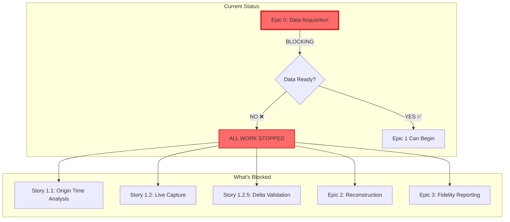

# RLX Data Pipeline - Project Status Dashboard

## 🔴 BLOCKED: Awaiting Data Acquisition



## Status by Epic

### Epic 0: Data Acquisition 🚨 **[IN PROGRESS - WEEK 1/3]**

| Task | Status | Blocker | Owner |
|------|--------|---------|-------|
| Verify Crypto Lake Access | 🔴 Not Started | Need credentials | TBD |
| Test API Authentication | 🔴 Not Started | Awaiting access | TBD |
| Download Sample Data | 🔴 Not Started | Awaiting auth | TBD |
| Set Up Infrastructure | 🔴 Not Started | - | TBD |
| Download 12 Months Data | 🔴 Not Started | Awaiting setup | TBD |
| Validate Data Integrity | 🔴 Not Started | Awaiting data | TBD |
| Issue Readiness Certificate | 🔴 Not Started | All above | TBD |

**Completion**: 0% | **Target**: Week 3 | **Risk**: HIGH (no access verified)

### Epic 1: Analysis & Validation ⏸️ **[BLOCKED BY EPIC 0]**

| Story | Previous Status | Actual Status | Reason |
|-------|----------------|---------------|---------|
| 1.1: Origin Time | "Complete" ❌ | Invalid | Used synthetic data |
| 1.2: Live Capture | "Drafted" | Blocked | Need real data first |
| 1.2.5: Delta Validation | "Ready" | Blocked | No data to validate |

**Cannot start until**: Epic 0 complete

### Epic 2: Reconstruction Pipeline ⏸️ **[BLOCKED BY EPIC 1]**

| Component | Status | Dependency |
|-----------|--------|------------|
| DataAssessor | Cannot Build | Need real data characteristics |
| Reconstructor | Cannot Build | Strategy depends on data analysis |
| Streaming Pipeline | Cannot Build | Memory requirements unknown |

**Cannot start until**: Epic 1 validation complete

### Epic 3: Fidelity Reporting ⏸️ **[BLOCKED BY EPIC 2]**

| Component | Status | Dependency |
|-----------|--------|------------|
| Golden Sample Capture | Cannot Start | Need Epic 1 complete |
| Metrics Implementation | Designed | Waiting for data |
| Automated Reporting | Designed | Waiting for pipeline |

**Cannot start until**: Epic 2 complete

## Timeline Visualization

```
Week 1  2  3  4  5  6  7  8  9  10 11 12 13 14 15 16 17 18 19 20
━━━━━━━━━━━━━━━━━━━━━━━━━━━━━━━━━━━━━━━━━━━━━━━━━━━━━━━━━━━━━━━━
[Epic 0: Data Acquisition    ] 🔴 CURRENT FOCUS
         [Epic 1: Analysis       ] ⏸️ BLOCKED
                 [Go/No-Go]
                     [Epic 2: Reconstruction    ] ⏸️ BLOCKED  
                                 [Epic 3: Valid. ] ⏸️ BLOCKED
                                         [Prod.  ] ⏸️ BLOCKED
```

## Risk Register

| Risk | Impact | Likelihood | Mitigation |
|------|--------|------------|------------|
| No Crypto Lake Access | Project Stop | Unknown | Escalate TODAY |
| Data Quality Issues | 2-4 week delay | Medium | Early validation |
| Delta Feeds Unavailable | Reduced fidelity | Medium | Fallback strategy ready |
| Memory Constraints | Architecture change | Low | Streaming design ready |

## Key Metrics

### Data Acquisition Progress
```
Downloaded:    [                    ] 0%
Validated:     [                    ] 0%
Ready:         [                    ] 0%
```

### Overall Project Progress
```
Epic 0: [                    ] 0%   🔴 BLOCKING
Epic 1: [                    ] 0%   ⏸️ BLOCKED
Epic 2: [                    ] 0%   ⏸️ BLOCKED
Epic 3: [                    ] 0%   ⏸️ BLOCKED
```

## Immediate Actions Required

### 🚨 TODAY
1. **Find out who has Crypto Lake access**
2. **Verify subscription is active**
3. **Get API credentials**

### 📅 This Week
1. Complete Epic 0 Week 1 tasks
2. Daily status updates on data acquisition
3. Escalate any blockers immediately

## Communication Channels

- **Daily Updates**: #rlx-data-pipeline (Slack)
- **Blockers**: Escalate within 2 hours
- **Technical Issues**: [Engineering Lead]
- **Access Issues**: [VP Engineering]

## Definition of Done

### Epic 0 Complete When:
✅ 12 months BTC-USDT data in ready zone  
✅ All integrity validations passed  
✅ Data manifest documented  
✅ Readiness certificate issued  
✅ Epic 1 enabled to start  

---

**Last Updated**: 2025-07-19 | **Next Update**: Daily until Epic 0 complete